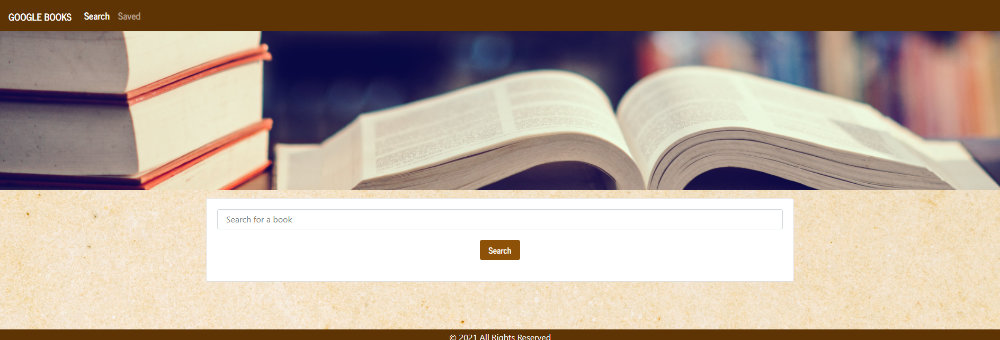

# Google Book Search  

## Description
An application to search the Google Books API for the search parameters given, save selected books to a MongoDB database, and allow the user to view them, and delete them.  

## Table of Contents
  - [Google Book Search](#google-book-search)
  - [Description](##description)
  - [Table of Contents](##table-of-contents)
  - [Deployed Portfolio](##deployed-portfolio)
  - [Screenshots](##screenshots)
  - [License](##license)
  - [Credits](##credits)
  - [Technologies Used](##technologies-used)
  - [Contact Information](##contact-information)

## Deployed Portfolio 

The live site is found at [Heroku](https://obscure-beach-39028.herokuapp.com/) 

## Screenshots

Screenshots of the pages follow below: 

Search bar 

Saved Books  

Functionality for the saved button, as well as rendering a placeholder when no image is returned for some elements of the search array

 

  
## License 
Licensed under the [MIT License](LICENSE).

## Credits
<a href="https://www.freepik.com/photos/background">Background photo created by jcomp - www.freepik.com</a>

## Technologies used 
- HTML
- CSS
- Bootstrap CSS library
- React JS
- React-router-dom npm
- Node.js
- MongoDB
- Mongoose
- Express
- Javascript

## Further Developments

There were architectural decisions to be made in the development of this application.  Mainly surrounding how the google API was going to be called.  The choices being:  setting up all routes from the react app to the server, and then accessing the webAPI from the server, or by accessing the webAPI directly from the react app.  

I decided to go with the accessing it from the react app, simply because this was a more familiar approach.  It may be an interesting experiment to then try and refactor this in the future to try the alternative approach. 
  

## Contact information
Claire Davies:  

- [Github](https://github.com/ClaireMDavies) 
- [Email](mailto:claire.davies@junitech.com)